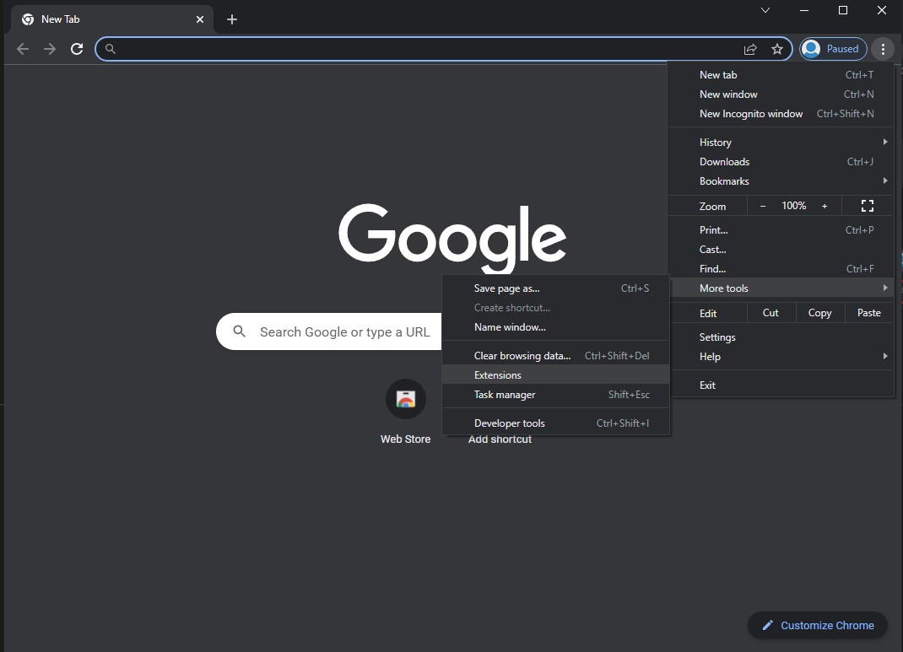
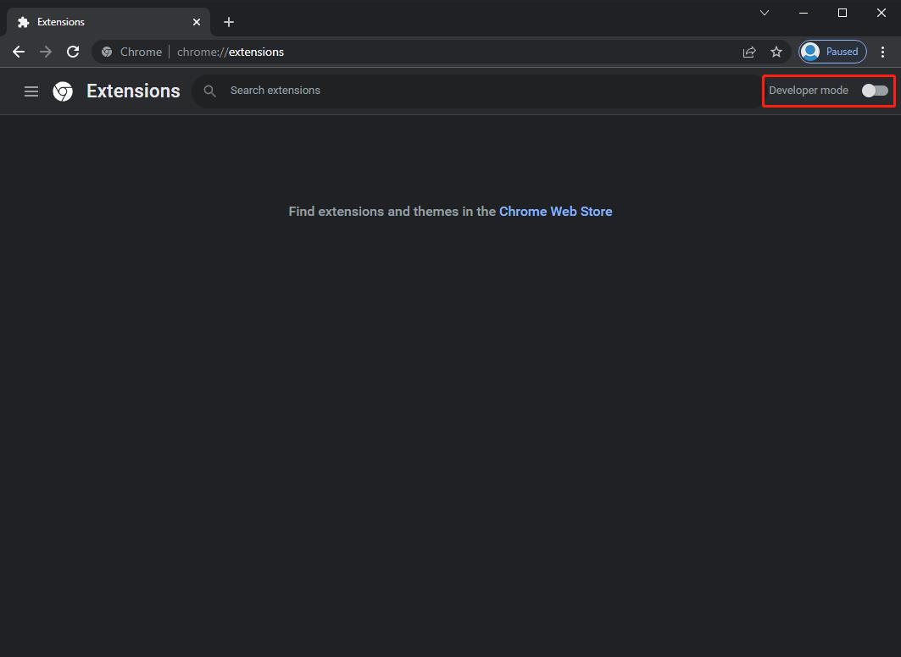
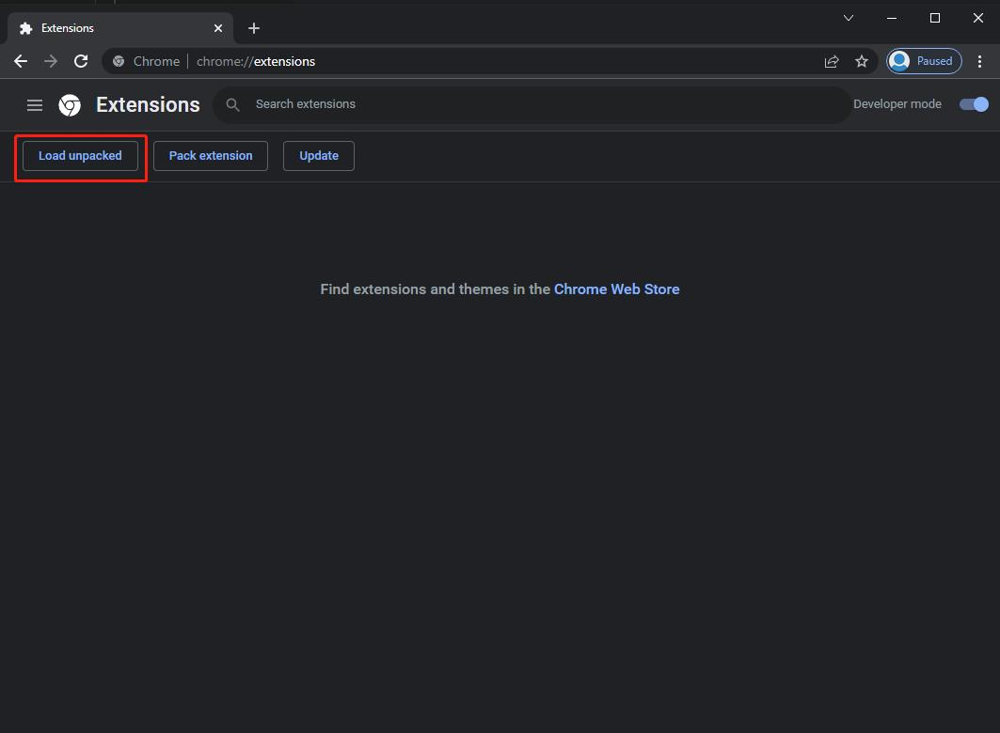
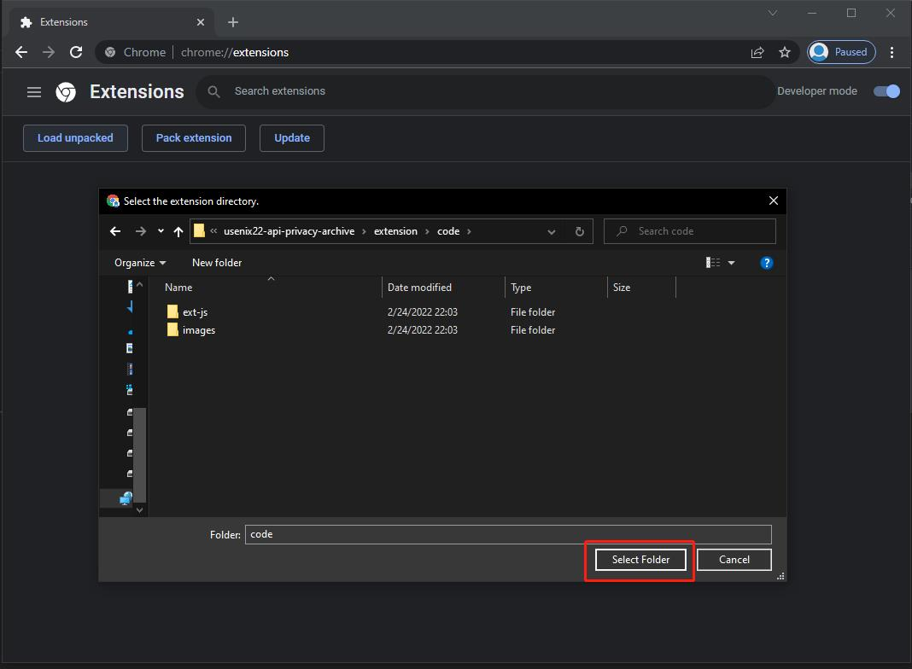
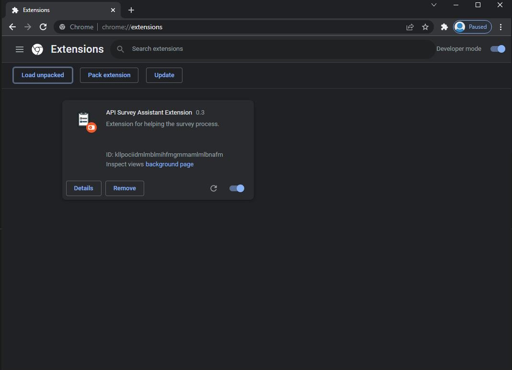
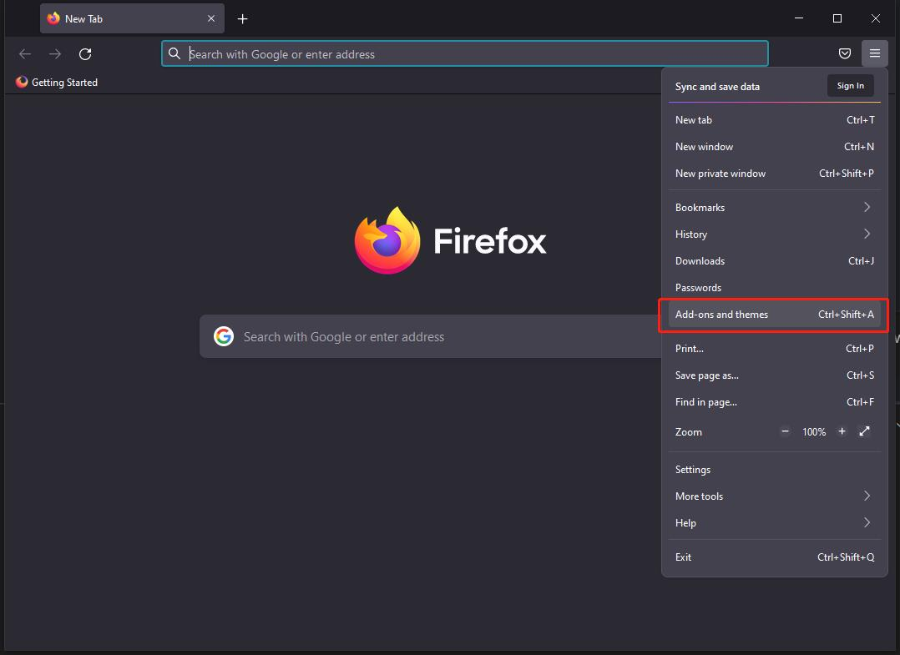
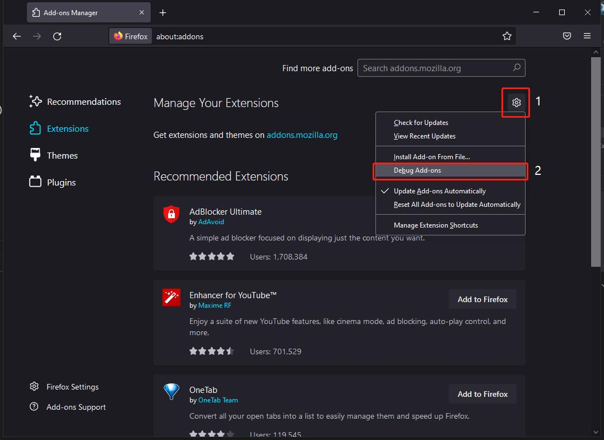
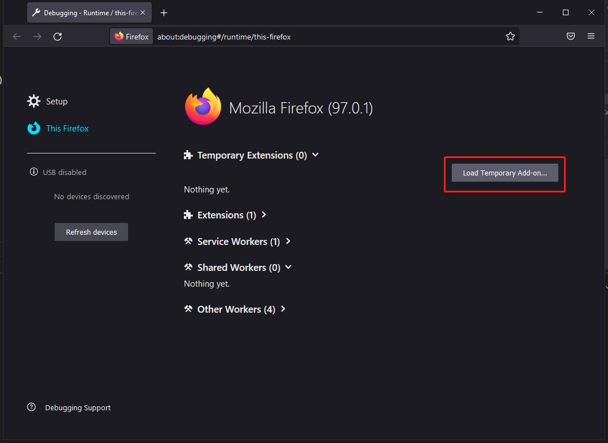
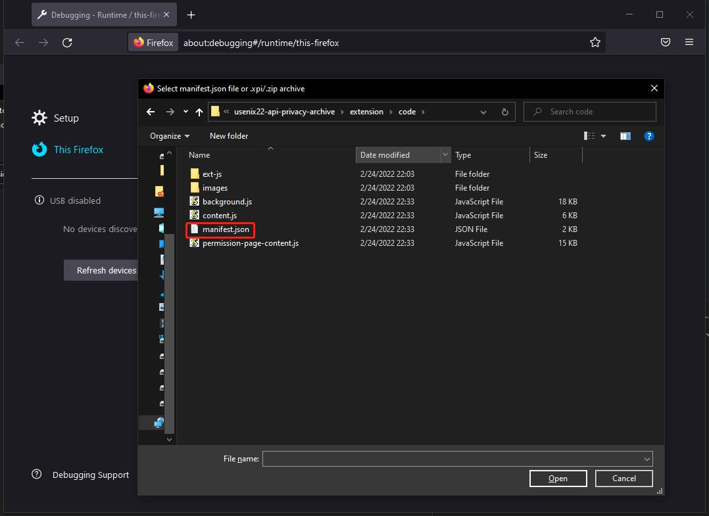
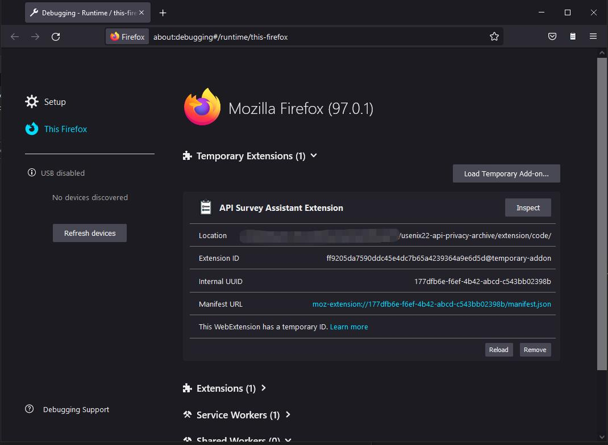

## Extension

* [Extension Code](./code/)

Our extension runs on Chrome and Firefox browsers. Only participants of the main-survey were required to install the extension.

### Installation Instruction:
* Note: During the survey, participants do not need to go through the following process. The instructions for installing the extension is provided during the survey with a combination of screenshots and descriptions.
* **Chrome**: 
    1. Type `chrome://extensions/` in the address bar or follow the image below and click on the "Extensions" button to open the extensions menu.
    2. Click the toggle on the top right corner to enable developer mode.
    3. Click the "Load unpacked" button.
    4. Locate the `code` folder, double click and click "Select Folder".
    5. If the "API Survey Assistant Extension 0.3" shows up (shown below), then the extension is correctly loaded into your Chrome browser for development purpose.
* **Firefox**:
    1. Type `about:addons` in the address bar or follow the image below and click on the "Add-ons and themes" button to open the extensions menu.
    2. Click on the gear icon first and then the "Debug Add-ons" button to install extension for development purpose.
    3. Click the "Load Temporary Add-on..." button to install extension from a local source.
    4. Locate the `code` folder, double click to open it. After that, double click the `manifest.json` file to load the extension.
    5. If the "API Survey Assistant Extension" shows up (shown below), then the extension is correctly loaded into your Firefox brwoser for development purpose.
### File Structure:
* **images** - Includes the icon for the browser extension in multiple different dimensions.
* *background.js* - Script running in the background and wait for the survey to call upon it. Provides several functionalities:
    1. Launch the Google permissions page from the survey in a new tab. Furthermore.
    2. Start a count down timer and close the permissions page automatically when the timer runs out.
    3. When the Google permissions page is open, receive information about all the third-party apps authorized on the participant's account from `permission-page-content.js`.
    4. Extract information about the oldest, newest and one random app among all the apps and send them to the survey as part of the survey results. 
* *content.js* - Script running in the background when the participant is on the survey page. It sends messages to `background.js` once the participant is about to open the Google permissions page and receives results from `background.js`.
* *manifest.json* - Manifest file that specifies permissions needed, which script to run when a tab is active.
* *permission-page-content.js* - Script running in the background when participants are on the Google permissions page. Provides the following functionalities:
    1. Show a banner at the top of the page informing participants they are still within the survey. The count down timer is also shown at the top which informs participants about how much time they have left for browsing this page.
    2. Disable links to external pages to prevent participants from sidetracked.
    3. Collect information about all the third-party apps that appear on this page and send it to `background.js` for processing.