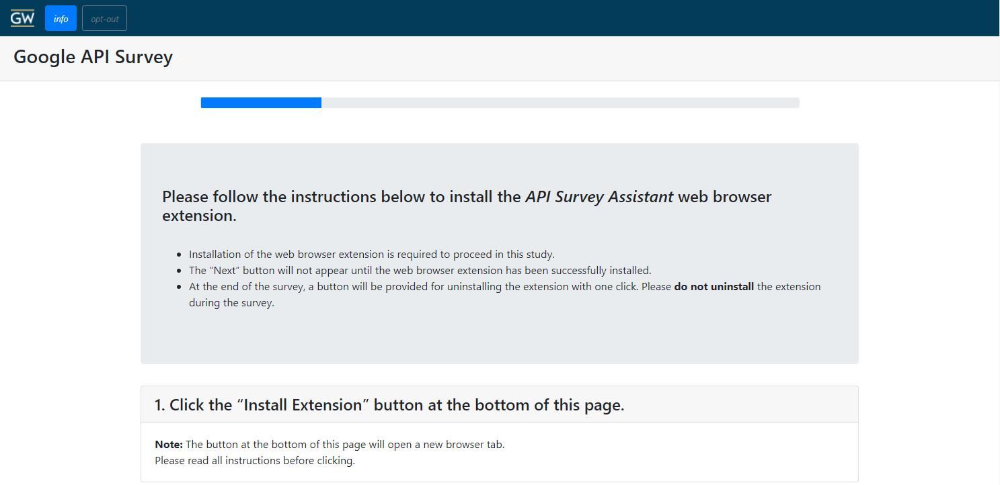

## Survey

* [Survey Code](./web/)

Our survey contains two parts, a pre-survey for screening and a main-survey. The pre-survey does not rely on the browser extension but the main-survey depends on successful installation of the browser extension on participants' browser.

### Installation/Running Instruction:

Ensure that you have docker installed on your machine first.

Change into the docker directory
```
cd docker
```

Build the docker environment

```
docker-compose build
```

If this is the first time running:

```
docker-compose up -d
docker-compose run django python backend/manage.py makemigrations
docker-compose run django python backend/manage.py migrate
```

Otherwise, you can just bring up the entire environment

```
docker-compose up -d
```

To bring down the environment

```
docker-compose stop
```

Then you can:

 * Access the survey: [localhost/root](localhost/root)
   * Choose the start of the pre or main survey   
 * Access the database via phpmyadmin to see stored results: [localhost:8080](localhost:8080)
   * username: user
   * password: user-password

Note for the main survey, you will need to install the browser extension when you reach the page shwon in the following image.
Rather than following the instructions provided on this page, you need to manually install the browser extension following the guide provided [here](../extension/README.md) due to the survey running locally. The **Next** button, for proceeding to the next page, will appear at the bottom of this page once the extension is correctly installed.

### File Structure:
* **completion**
  * *index.html* - Static dummy completion page for both the pre-survey and main-survey. This page informs participants that they have completed the survey during our internal testing stage.
* **css**
  * *custom.css* - Custom stylesheet that supports functionalities of both survey using the SurveyJS library.
  * *google-style.css* - Parts from the stylesheet of Google's permission page that were used in our main-survey for the purpose of presenting the look of the permission page to participants.
  * *gw-style.css* - Custom stylesheet that provides navigation bar styling specifically for the George Washington University GWUSEC Lab.
* **ext-css** - Folder containing external stylesheets for Bootstarp and SurveyJs used for styling.
* **ext-js** - Folder containing external javascripts for Bootstrap and SurveyJs used for survey functionalitites.
* **extensions** - Packages signed by Mozilla Firefox that are used for installing the browser extension on Firefox browsers.
* **fonts** - Folder containing font packages used for survey text.
* **icons** - Folder containing icons used for survey.
* **js**
  * *custom-widget.js* - Script that setup widgets and styling of the survey.
  * *debug.js* - Script that provides debug functionality for the survey. Debug functionalities include:
    1. Reveal debug buttons and a banner message in the navigation bar.
    2. Re-render a page of the survey.
    3. Update the URL of the current page.
    4. Enable debugger to jump to any page of the survey.
    5. Restart the entire survey by clearing local storage
  * *static-content.js* - Static elements of the survey including survey instructions, extension installation instructions, warning messages and context for certain sections.
  * *survey-common.js* - Functions used in both pre-survey and main-survey are included in this script.
    * Load and save the state of the survey so users do not lose progress when reloading the survey page.
    * Withdraw user from the survey when they click the withdraw button.
    * Redirect user back to Prolific upon survey completion. There is a 30 seconds countdown that starts automatically upon completion of the survey.
  * *window-management.js* - Functions used in both pre-survey and main-survey that handles Cookie storage, browser compatibility checking and browser window size checking. 
* **main-survey**
  * **images** - Images used in the main-survey for browser extension installation instructions.
  * **js**
    * *main-survey.js* - Script for the main survey.
      * `renderButton()` and `googleSignInComplete(googleUser)` are functions for embedding Goolge's Single Sign On (SSO) into the survey, which screens people on whether they have a Google account or not.
      * `launchMyAccountPageInNewTab()` sends a message to the browser extension and opens the Google Permissions page in a new tab.
      * `isExtensionInstalled()` checks if the extension is properly installed in participants' browser.
      * `uninstallExtension()` and `uninstallExtensionNoCountdown()` both uninstall the browser extension. The only difference is the first function will automatically start a count down for redirecting the user to Prolific for survey completion while the second function only uninstall the extension.
      * `camelCase(str)` and `kebabCase(str)` turns the input string into corresponding case.
      * `prepareSurveyResults(survey)` and `appResultParser(resultsJSON, whichApp)` parses raw result of the survey into JSON format that is convenient for the django backend to process and store in the mySQL database.
      * `sendPartialSurveyResultsToTheServer(survey)` and `sendSurveyResultsToTheServer(survey)` sends survey results to our server. The first function is called when user did not complete the entire survey but left or reloaded the survey page. The second function is called when the entire survey is completed.
      * `createSSOTPContext(SSOOrTP)` and `createAppContext(appJSON)` create customized context for each participants based on the information collected by the browser extension from participants' permissions page.
      * `createAppsAuthorizedMatrix(TPJSON)` and `createNeceConcMatrix(appJSON, appPermNeceName, appPermConcName, appPermUndeName)` are helper functions that converts questions with dynamic results (varies by each participants) into uniform JSON format for backend processing.
      * `convertMillitoDate(milliseconds)` converts time from milliseconds into date format.
      * `registerSurveyListener(survey)` survey code which runs under conditions such as loading in functionalities for certain pages, sending partial results before the survey page is closed as well as sending full results of the survey once completed.
      * `loadAppsData(localStorageDataName)` and `saveAppsDataOnReload(localStorageDataName)` loads and saves information collected from Google's permission page on local storage in case participants reload the survey page.
    * *result-raw.json* - Raw result from the survey that was used to help form the result-template.json.
    * *result-template.json* - JSON file that helps us keep track of how the result looks like when building the result receiving end.
    * *static-content.js* - This file contains all the static html including instructions, contexts and prompts for the main-survey.
    * *survey-config.js* - This file contains all the survey configuration of the main-survey utilizing the SurveyJS library in a JSON format.
  * *index.html* -  Main html page for the main-survey including all the stylesheets and scripts needed, static elements as well as `div` elements to hold the survey content.
* pre-survey
  * **image**s - Screenshots used in the survey to provide participants with context.
  * **js**
    * *pre-survey.js*
      * `renderButton()` and `googleSignInComplete(googleUser)` are functions for embedding Goolge's Single Sign On (SSO) into the survey, which screens people on whether they have a Google account or not.
      * `registerSurveyListener(survey)` is the main function for the survey and there are 4 sub-parts.
        * `survey.onComplete` executes when the entire survey is completed. It inserts a timestamp, the userId as well as prolificId into the result, remove the email address of the participant and send the result as a JSON to our server through a POST call.
        * `survey.onPartialSend` does similar things to `survey.onComplete` but only executes when the survey is not complete and participant moves to the next page. This is to ensure if a participant accidently refreshes or closes the survey page, their progress is not lost.
        * `survey.onAfterRenderPage` executes after a page of the survey is rendered. Only 2 pages within the pre-survey triggers codes in this part.
          1. When participant are asked to log into their Google account, we ask whether the accounts they used are their primary account. If they are, they will be able to proceed; if they are not, we ask them to log into their primary account.
          2. After participant log into their Google account through SSO and move onto the next page of the survey, we immediately log them out to ensure we do not have any personal identifiable information of the participant.
        * `survey.onValueChanged` executes when the answer to a question is changed. We use this on the Google account SSO page. When participants tell us they are logged into their primary Google account, we enable them to proceed to the next page of the survey. Ohterwise, they are asked to log into their primary account.
      * `function loadAuthuserID(localStorageAuthIDName)` loads the userId from browser's local storage which enables a user to pick up from where they left off in the survey.
      * `function saveAuthuserID(localStorageAuthIDName)` saves the userId to browser's local storage which ensures their survey progress is not lost.
      * In the final part of this javascript, we register all the survey listeners, call the `loadState` and `loadAuthuserID` functions to load any previously saved progress. Furthermore, before the survey window unloads, we call the `saveState` and `saveAuthuserID` functions to save the progress. Finally, the survey configuration is rendered into the `surveyElement` `div` element.
    * *static-content.js* - This file contains all the static html including instructions, contexts and prompts for the pre-survey.
    * *survey-config.js* - This file contains all the survey configuration utilizing the SurveyJS library in a JSON format.
  * *index.html* - Main html page for the pre-survey including all the stylesheets and scripts needed, static elements as well as `div` elements to hold the survey content.
* **root**
  * **js**
    * *root.js* - Functions used for internal testing purpose, which randomly generates prolific IDs upon entering the survey.
  * *index.html* - Root page of the entire survey, only available for developers as a mean to select pre-survey or main-survey for testing.
* *index.html* - Automatically redirects to the index page under **root** folder.
